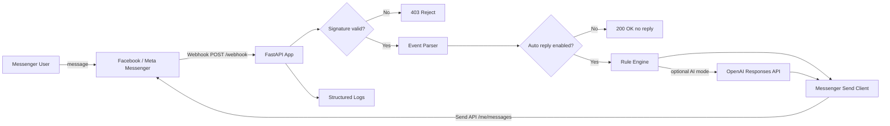

# Messenger Auto Reply Bot


FacebookページのMessengerに届いたメッセージへ、自動返信するためのFastAPIアプリです。

標準は**ルールベース返信**です。任意でOpenAI APIを接続すると、AI返信にも切り替えられます。Meta側の設定が完了すれば、公開HTTPS URLの `/webhook` をMessenger Webhookとして登録して運用できます。

## できること

- Facebook Messenger Platform Webhookの検証 `GET /webhook`
- Messengerイベント受信 `POST /webhook`
- `X-Hub-Signature-256` によるWebhook署名検証
- JSON設定ファイルによる返信ルール管理
- Page Access Tokenを使ったMessenger Send API返信
- OpenAI APIを使うAI返信モードへの任意切り替え
- GitHub Actions CI、テスト、ruff lint、coverage artifact
- Docker / devcontainer対応

## 本番運用に必要なもの

| 必要なもの | 用途 | Secret / 環境変数 |
| --- | --- | --- |
| Meta Developer App | Messenger Webhookを接続するため | なし |
| Facebook Page | Messengerの送受信元 | なし |
| Page Access Token | Messenger Send APIで返信するため | `PAGE_ACCESS_TOKEN` |
| Verify Token | MetaがWebhook URLを確認するための合言葉 | `VERIFY_TOKEN` |
| App Secret | Webhook署名検証に使用 | `APP_SECRET` |
| 公開HTTPS URL | MetaからWebhookへPOSTしてもらうため | デプロイ先で発行 |
| OpenAI API Key 任意 | AI返信モードを使う場合のみ | `OPENAI_API_KEY` |

実値はGitHubにコミットしません。デプロイ先のSecret / Environment Variablesに保存してください。

## アーキテクチャ



## GPT Image 2でガイダンス画像を作るためのプロンプト

OpenAI APIのGPT Imageモデルでは、最新の `gpt-image-2` を使って構成図や手順画像を生成できます。初心者向けの設定資料を作る場合は、次のプロンプトを `gpt-image-2` に渡してください。

```text
Create a clean Japanese step-by-step onboarding infographic for a Facebook Messenger auto-reply bot. Show: 1) Meta Developer App, 2) Facebook Page Access Token, 3) Webhook Callback URL ending in /webhook, 4) Verify Token, 5) App Secret signature verification, 6) FastAPI app deployed on HTTPS, 7) Messenger Send API response. Use simple icons, arrows, numbered steps, and beginner-friendly labels. No real secrets, no token values.
```

## ローカル起動

```bash
cp .env.example .env
python -m venv .venv
source .venv/bin/activate
pip install -e ".[dev]"
uvicorn app.main:app --reload --port 8000
```

確認:

```bash
curl http://localhost:8000/health
curl "http://localhost:8000/webhook?hub.mode=subscribe&hub.verify_token=dev-verify-token&hub.challenge=hello"
```

ローカルでMeta Webhookをテストする場合は、ngrokなどで `http://localhost:8000` をHTTPS公開し、Meta側のCallback URLに `https://xxxx.ngrok-free.app/webhook` を設定します。

## 環境変数

```dotenv
VERIFY_TOKEN=dev-verify-token
PAGE_ACCESS_TOKEN=
APP_SECRET=
GRAPH_API_VERSION=v25.0
AUTO_REPLY_ENABLED=true
AUTO_REPLY_MODE=rules
REPLY_RULES_PATH=config/reply_rules.example.json
OPENAI_API_KEY=
OPENAI_MODEL=gpt-5.4-mini
OPENAI_SYSTEM_PROMPT=あなたはFacebookページの丁寧な一次受付担当です。短く自然に日本語で返信してください。
```

## Meta側の初期設定

詳細は `docs/setup.md` を見てください。概要は次の通りです。

1. Meta for Developersでアプリを作成
2. Messenger productを追加
3. Facebook Pageを接続
4. Page Access Tokenを取得してデプロイ先の `PAGE_ACCESS_TOKEN` に保存
5. 任意の長い文字列を `VERIFY_TOKEN` として決め、デプロイ先に保存
6. App Secretを `APP_SECRET` に保存
7. Webhook Callback URLに `https://your-domain.example.com/webhook` を登録
8. Verify Tokenに `VERIFY_TOKEN` と同じ値を入力
9. `messages` と `messaging_postbacks` を購読
10. FacebookページへMessengerでテスト送信

## テスト

```bash
pip install -e ".[dev]"
ruff check .
pytest --cov=app --cov-report=term-missing
```

## 主要ファイル

| ファイル | 内容 |
| --- | --- |
| `app/main.py` | FastAPIルーティングとWebhook処理 |
| `app/security.py` | Meta署名検証 |
| `app/rule_engine.py` | JSONルールによる返信選択 |
| `app/meta_client.py` | Messenger Send APIクライアント |
| `app/ai_reply.py` | 任意のOpenAI返信モード |
| `config/reply_rules.example.json` | 返信ルールのサンプル |
| `docs/setup.md` | Meta設定手順 |
| `docs/architecture.md` | アーキテクチャ詳細 |
| `.github/workflows/ci.yml` | CI/CD |

## 注意

- Page Access Token、App Secret、OpenAI API KeyをGitHubにコミットしないでください。
- Messenger Platformには送信可能なメッセージ種別やポリシーがあります。ページへ届いた通常メッセージへの返信を基本にし、プロモーション目的の一方的な送信はMetaのルールに従ってください。
- AI返信モードを使う場合は、個人情報や機密情報を含むメッセージを外部APIへ送る可能性があるため、利用者への説明と社内ポリシー確認を行ってください。
