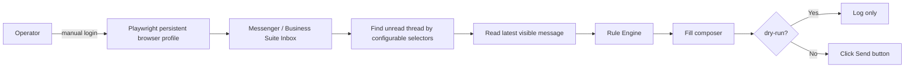

# Playwright Messenger Auto Reply Mode

Access Tokenを使わず、Playwrightでブラウザ上のMessenger / Business Suite Inboxを操作する方式です。

## 最短手順

```bash
pip install -e ".[dev]"
python -m playwright install chromium
python scripts/run_browser_messenger_bot.py --login-only
python scripts/run_browser_messenger_bot.py --once
python scripts/run_browser_messenger_bot.py --once --send
```

標準はdry-runです。実送信する場合だけ `--send` を付けます。

## 処理フロー



詳細は `docs/browser-automation.md` を参照してください。
