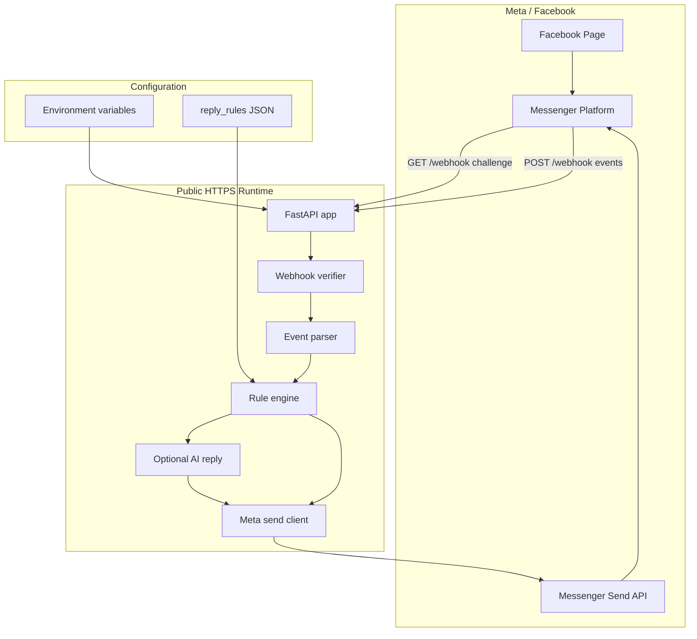
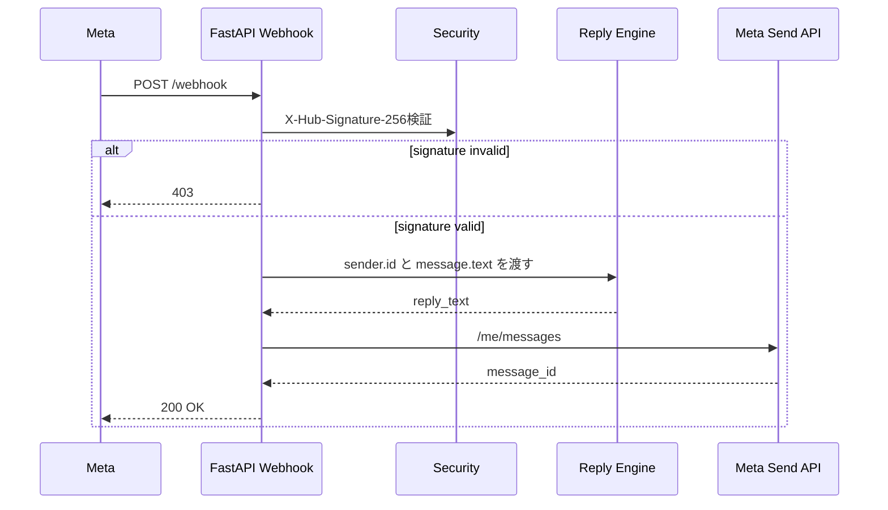

# Architecture

このドキュメントは、Messenger Auto Reply Botの全体設計、処理フロー、拡張方針を説明します。



## Webhook検証

Meta Developer ConsoleでCallback URLを登録すると、Metaは `GET /webhook` に `hub.mode`、`hub.verify_token`、`hub.challenge` を送ります。アプリは `VERIFY_TOKEN` と一致した場合のみchallengeをそのまま返します。

## メッセージ受信



## 主要コンポーネント

| コンポーネント | ファイル | 責務 |
| --- | --- | --- |
| FastAPI app | `app/main.py` | ルーティング、Webhook入口、レスポンス集約 |
| Settings | `app/config.py` | 環境変数読み込み |
| Security | `app/security.py` | Meta Webhook署名検証 |
| Rule Engine | `app/rule_engine.py` | JSONルールに基づく返信文選択 |
| Meta Client | `app/meta_client.py` | Messenger Send API呼び出し |
| AI Reply | `app/ai_reply.py` | 任意のOpenAI返信生成 |

## CI/CD

```mermaid
flowchart LR
    Push[push / pull_request / workflow_dispatch] --> Checkout
    Checkout --> Python[setup-python]
    Python --> Install[pip install -e .[dev]]
    Install --> Ruff[ruff check]
    Ruff --> Pytest[pytest coverage]
    Pytest --> Artifact[upload coverage.xml]
    Checkout --> Docker[docker build]
```

## GPT Image 2による説明画像の作成

OpenAI APIで最新のGPT Imageモデル `gpt-image-2` を使う場合、以下のプロンプトで運用ガイド用の図を作れます。

```text
Create a Japanese architecture diagram for a Facebook Messenger auto-reply bot. Include Facebook Page, Messenger Webhook, FastAPI app, signature verification, rule engine, optional AI reply, Messenger Send API, environment secrets, and GitHub Actions CI. Use clear arrows, numbered flow, soft colors, and labels suitable for beginners. Do not include real tokens or secrets.
```
